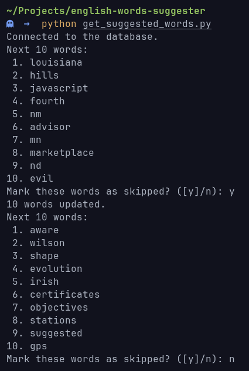

# English Words Suggester
Just some small Python scripts to suggest me some frequenly used english words so I can add it to Anki and Obsidian.

I got the english words collection sorted by frequency from [Kaggle - english-word-frequency](https://www.kaggle.com/datasets/rtatman/english-word-frequency).

Summarise the program:
- Each word has the boolean value `skip` indicate that I want it to be suggested or not (saved on MYSQL database).
- Each time running, the programm suggests 10 words that `skip = FALSE` and `id >= WORD_ID_LOWER_THRESHOLD` (as I don't want to learn too easy words). Mark all those words as skipped and the programm would suggest the next 10 words satisfied.
## Set up
- Create the MYSQL database and their tables for the project
```sql
CREATE DATABASE `english-words-suggester`;

USE `english-words-suggester`;

CREATE TABLE english_words (
  id INT AUTO_INCREMENT PRIMARY KEY,
  word VARCHAR(255),
  count BIGINT UNSIGNED,
  skip BOOLEAN
);

CREATE TABLE settings (
  `name` VARCHAR(255) PRIMARY KEY,
  `val` INT
);
```
- Create the corresponding user for the database
```sql
CREATE USER 'english-words-suggester'@'localhost'; 
GRANT SELECT, INSERT, UPDATE, DELETE ON `english-words-suggester`.* TO 'english-words-suggester'@'localhost'; 
ALTER USER 'english-words-suggester'@'localhost' IDENTIFIED BY 'english-words-suggester';
```

- Modify the value of `WORD_ID_LOWER_THRESHOLD` in `setup_database.py`. Default to `3000` because I want to skip the first 3000 words.

- Run `setup_database.py` for importing the data from `unigram_freq.csv` into your MYSQL database.
```python
python setup_database.py
```
- You can run `python /path/to/get_suggested_words.py` to test that it works fine.
<p align="center">

</p>
- For easier use, create a bash script for running the program (remember to grant execute permission for the file too).

```bash
#!/bin/bash

# Call update_skip_words.py (You probably won't need it, read below)
python /path/to/update_skip_words.py

# Call get_suggested_words.py
python /path/to/get_suggested_words.py
```

### Note
- `update_skip_words.py` is for update `skip = TRUE` for all the words that I have learnt and added to Anki (those words exist as markdown file used with Obsidian)


